# 🍞 Flujo de Pedidos y Reglas de Negocio - Los Trigales

Este documento describe el ciclo de vida completo de un pedido dentro del sistema, las validaciones de seguridad y la lógica de asignación de sucursales.

## 1. Actores y Roles

| Rol | Descripción | Responsabilidad Principal |
| :--- | :--- | :--- |
| **Sucursal / Cliente** | Punto de venta o cliente B2B. | **Crear** pedidos y **Recibir** mercadería. |
| **Panadero** | Personal de cocina en una Planta. | **Producir** el pedido y marcarlo listo. |
| **Transportista** | Chofer de la empresa. | **Retirar** pedidos listos de CUALQUIER planta y **Entregarlos**. |
| **Gerente / Admin** | Supervisión global. | Ver métricas, gestionar catálogo y usuarios. |

---

## 2. Estructura de Sucursales (Logística)

El sistema distingue dos tipos de "Sucursales" en la base de datos:

1.  **Planta de Producción (`esPlanta: true`)**:
    *   Lugar donde se fabrican los productos (ej: "Fábrica Central", "Panadería Norte").
    *   Es el **ORIGEN** de los pedidos.
    *   Tiene Panaderos y Transportistas asignados.

2.  **Punto de Venta (`esPlanta: false`)**:
    *   Lugar que solicita mercadería (ej: "Sucursal Centro", "Cliente Juan").
    *   Es el **DESTINO** de los pedidos.
    *   Tiene usuarios con rol `sucursal` o `cliente` asignados.

---

## 3. Ciclo de Vida del Pedido (Paso a Paso)

### Paso 1: Creación del Pedido (Solicitud)
*   **Quién:** Usuario con rol `sucursal` o `cliente`.
*   **Acción:** Llena el carrito y confirma el pedido.
*   **Reglas de Negocio:**
    *   **Origen:** El usuario DEBE seleccionar a qué **Planta de Producción** le está pidiendo (ej: "Quiero que esto lo fabrique la Planta Norte").
    *   **Destino:** El sistema asigna AUTOMÁTICAMENTE la sucursal del usuario logueado. No se puede editar (seguridad).
*   **Estado Inicial:** `pendiente`.

### Paso 2: Producción (Cocina)
*   **Quién:** Usuario con rol `panadero`.
*   **Validación:** El sistema solo le muestra los pedidos donde `origenId` coincide con SU planta asignada.
*   **Acciones:**
    1.  Ve un pedido `pendiente` -> Clic en **"Comenzar Producción"** -> Estado cambia a `en_produccion`.
    2.  Imprime la Comanda (Ticket) 🖨️.
    3.  Termina de cocinar -> Clic en **"Terminar Producción"** -> Estado cambia a `listo_despacho`.

### Paso 3: Logística (Despacho)
*   **Quién:** Usuario con rol `transportista`.
*   **Validación:** Ve **TODOS** los pedidos (de cualquier planta) que estén en `listo_despacho` o `en_ruta`.
*   **Acciones:**
    1.  Llega a la planta, carga la mercadería -> Clic en **"Retirar Pedido"** -> Estado cambia a `en_ruta`.
    2.  Llega al destino (Sucursal) -> Clic en **"Confirmar Entrega"** -> Estado cambia a `entregado`.

---

## 4. Diagrama de Estados

```mermaid
graph LR
    A[Pendiente] -- Panadero inicia --> B[En Producción]
    B -- Panadero termina --> C[Listo Despacho]
    C -- Transportista retira --> D[En Ruta]
    D -- Transportista entrega --> E[Entregado]
    A -- Admin cancela --> X[Cancelado]
```

## 5. Validaciones de Seguridad (Firestore Rules)

*   **Lectura:**
    *   `Sucursal`: Solo ve sus propios pedidos (`userId == auth.uid`).
    *   `Panadero`: Ve todos los pedidos donde `origenId` == Su Planta.
    *   `Transportista`: Ve todos los pedidos donde `origenId` == Su Planta.
*   **Escritura:**
    *   `Sucursal`: Solo puede crear. Solo puede editar si está `pendiente`.
    *   `Panadero`: Solo puede actualizar estado a `en_produccion` o `listo_despacho`.
    *   `Transportista`: Solo puede actualizar estado a `en_ruta` o `entregado`.

---

## 6. Estado Actual del Desarrollo

✅ **Implementado:**
*   Lógica de Origen/Destino en formulario.
*   Filtrado de pedidos por rol (Panadero/Transportista).
*   Botones de acción específicos por estado.
*   Impresión de comanda.

🚧 **Pendiente / Mejoras Futuras:**
*   Validación de stock de insumos al crear pedido.
*   Notificaciones en tiempo real (push/email) al cambiar de estado.
*   Firma digital o foto al entregar (prueba de entrega).
